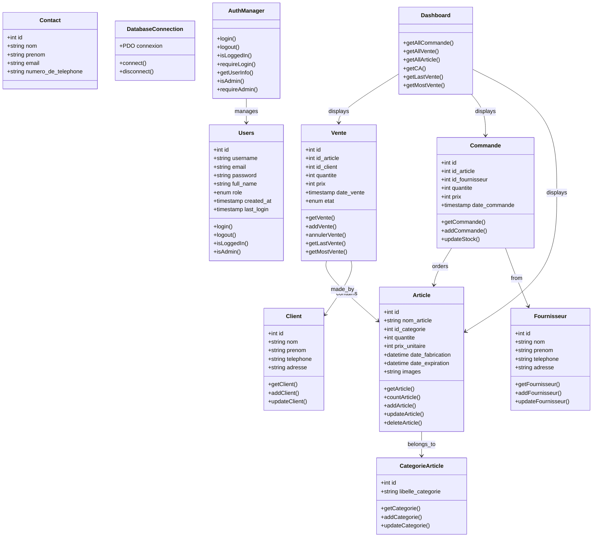
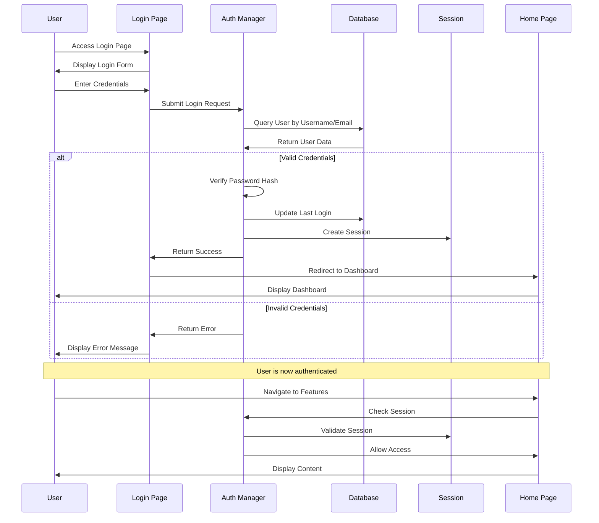
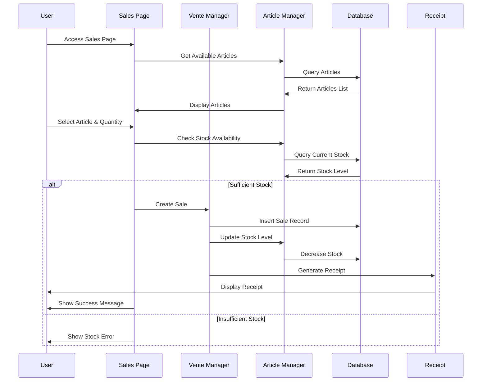
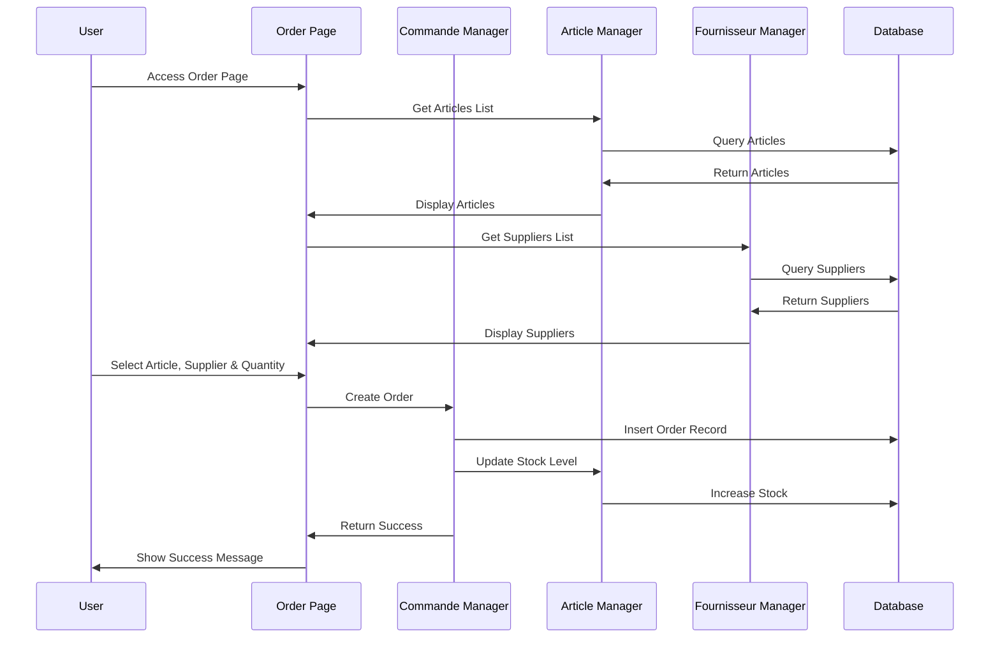
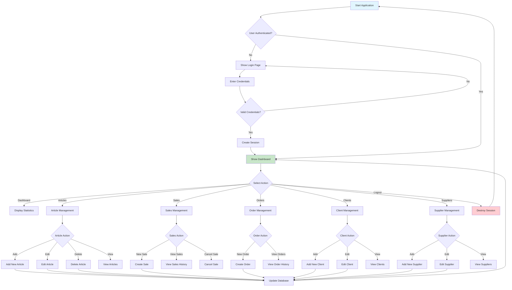
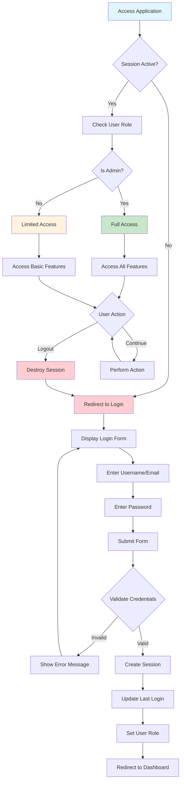

#  Stc-MNGM Stock Management System v2.0

## 📊 System Architecture Diagrams

### 🏗️ Class Diagram (Database Schema)



### 🔄 Sequence Diagram (User Authentication Flow)



### 🔄 Sequence Diagram (Sales Process)



### 🔄 Sequence Diagram (Order Process)



### 📋 Activity Diagram (Main System Flow)



### 🔐 Activity Diagram (Authentication Flow)



## 🚀 Enhanced Features

### ✨ New Features Added

1. **User Authentication System**
   - Secure login/logout functionality
   - Role-based access control (Admin/User)
   - Session management
   - Password hashing with bcrypt

2. **Enhanced UI/UX Design**
   - Modern gradient backgrounds
   - Glassmorphism effects with backdrop blur
   - Smooth animations and transitions
   - Responsive design for all devices
   - Enhanced color scheme with brand colors

3. **Logo Integration**
   - Custom  Stc-MNGM logo in sidebar and profile
   - Professional branding throughout the application

4. **Improved Navigation**
   - Enhanced sidebar with better visual hierarchy
   - Active state indicators
   - Hover effects and animations
   - Role-based menu items

5. **Enhanced Footer**
   - "Made with ❤️ by Wissal" signature
   - Version information
   - Professional styling

6. **Better Form Styling**
   - Modern input fields with focus states
   - Enhanced button designs
   - Improved alert messages
   - Better table styling

## 🔐 Authentication

### Default Login Credentials
- **Username:** `admin` or `wissal`
- **Password:** `admin123`
- **Email:** `admin@dclic.com` or `wissal@dclic.com`

### User Roles
- **Admin:** Full access to all features
- **User:** Limited access (basic operations)

## 🎨 Design Enhancements

### Color Scheme
- Primary: `#0a2558` (Deep Blue)
- Secondary: `#1e3a8a` (Medium Blue)
- Accent: `#e05260` (Coral Red)
- Background: Gradient from `#f5f7fa` to `#c3cfe2`

### Visual Effects
- Glassmorphism cards with backdrop blur
- Smooth hover animations
- Gradient buttons and backgrounds
- Shadow effects for depth
- Animated heart icon in footer

## 📁 File Structure

```
gstock-dclic/
├── auth/
│   └── login.php              # Login page
├── model/
│   ├── auth.php               # Authentication functions
│   ├── connexion.php          # Database connection
│   ├── function.php           # Core functions
│   ├── logout.php             # Logout handler
│   └── [other model files]    # CRUD operations
├── public/
│   ├── css/
│   │   ├── style.css          # Main styles
│   │   └── auth.css           # Authentication styles
│   └── images/
│       └── logo.png           #  Stc-MNGM logo
├── vue/
│   ├── entete.php             # Header with auth
│   ├── pied.php               # Footer with signature
│   └── [other view files]     # Page templates
├── gestion_stock.sql          # Database schema
├── index.php                  # Entry point
└── README.md                  # This file
```

## 🛠️ Installation

1. **Database Setup**
   ```sql
   -- Import the gestion_stock.sql file to create the database
   -- Default users will be created automatically
   ```

2. **File Permissions**
   ```bash
   # Ensure the images directory is writable
   chmod 755 public/images/
   ```

3. **Configuration**
   - Update database credentials in `model/connexion.php`
   - Ensure PHP has required extensions (PDO, MySQL)

## 🔧 Technical Improvements

### Security
- Password hashing with bcrypt
- Session-based authentication
- SQL injection prevention with prepared statements
- XSS protection with htmlspecialchars()

### Performance
- Optimized CSS with modern properties
- Efficient database queries
- Responsive images and assets

### User Experience
- Intuitive navigation
- Clear visual feedback
- Consistent design language
- Mobile-friendly interface

## 🎯 Key Features

### Dashboard
- Real-time statistics
- Recent sales overview
- Top-selling products
- Beautiful data visualization

### Inventory Management
- Add/edit/delete articles
- Category management
- Image upload support
- Stock tracking

### Sales & Orders
- Sales recording
- Order management
- Client management
- Supplier management

### Reporting
- Sales reports
- Inventory reports
- Receipt generation
- Print functionality

## 🚀 Getting Started

1. **Access the Application**
   - Navigate to your web server
   - You'll be redirected to the login page

2. **Login**
   - Use the default credentials above
   - Or create new users in the database

3. **Explore Features**
   - Dashboard for overview
   - Articles for inventory management
   - Sales for transaction recording
   - Reports for analytics

## 📱 Responsive Design

The application is fully responsive and works on:
- Desktop computers
- Tablets
- Mobile phones
- All modern browsers

## 🔄 Version History

### v2.0 (Current)
- Added user authentication
- Enhanced UI/UX design
- Logo integration
- Improved styling
- Better navigation
- Footer signature

### v1.0 (Original)
- Basic stock management
- CRUD operations
- Simple interface

## 👨‍💻 Developer

**Made with ❤️ by Wissal**

- **Version:** 2.0
- **Framework:** PHP (Vanilla)
- **Database:** MySQL
- **Styling:** CSS3 with modern features
- **Icons:** Boxicons

## 📞 Support

For support or questions, please contact the development team.

---

** Stc-MNGM Stock Management System** - Professional inventory management solution 